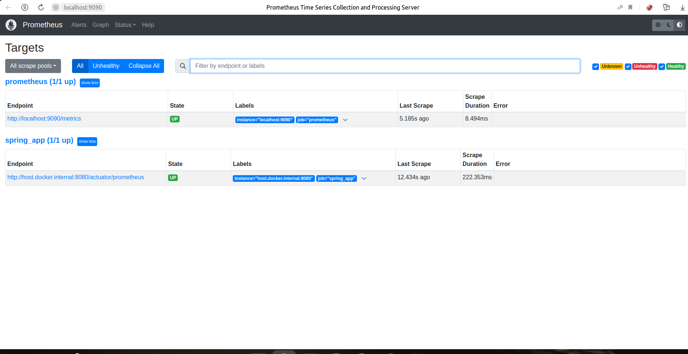
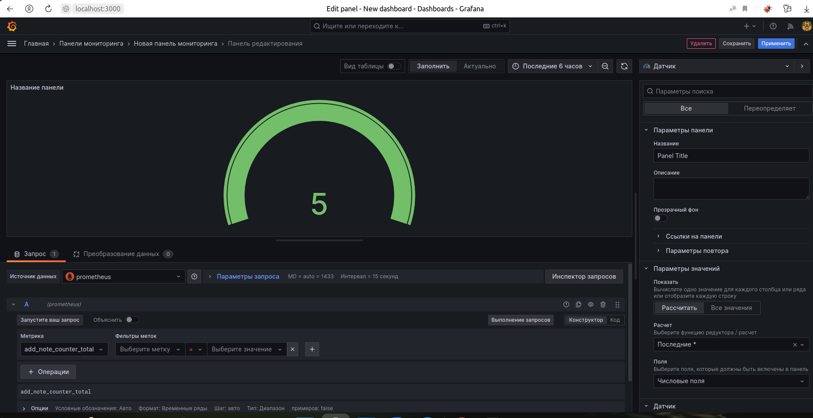

### ДОМАШНЕЕ ЗАДАНИЕ
1. Prometheus и Grafana запущены в контейнерах через Docker Desktop.
2. Конфигурация Prometheus в prometheus.yml
3. Подключение Prometheus: 
4. В Grafana смотрим на графическое отображение метрики add-note_counter_total 
5. Добавлена еще одна метрика number_request в NoteController
6. В Grafana смотрим на графическое отображение метрики number_request_total  